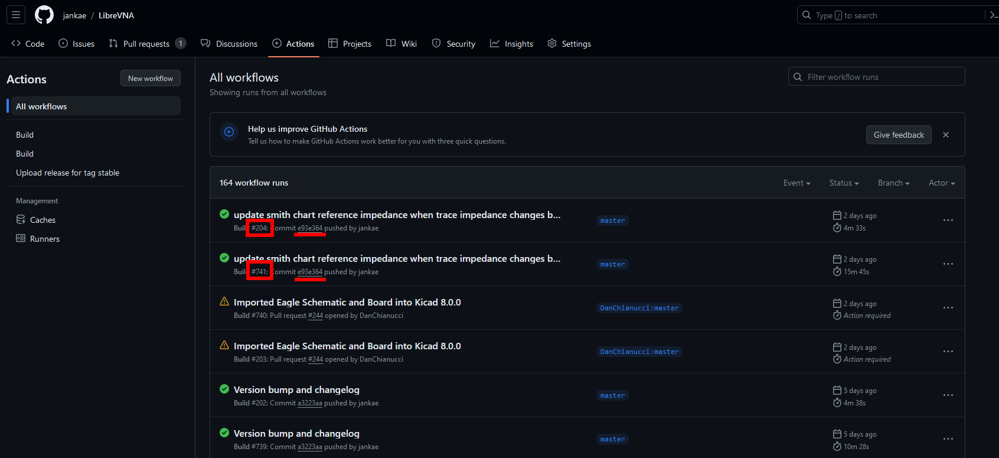
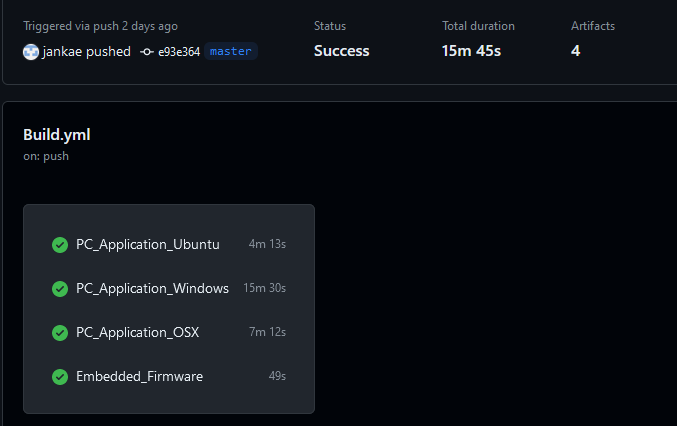
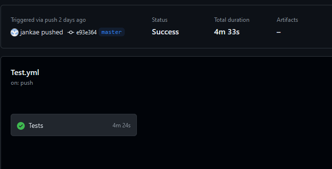
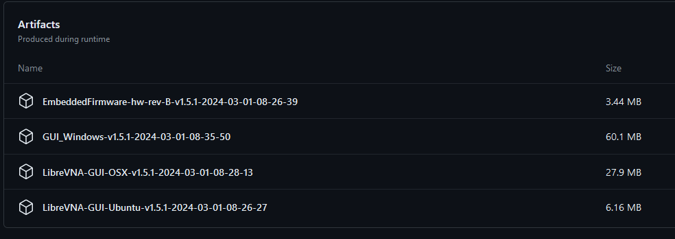

# Download automatically build binaries

The Github actions are set up in such a way that binary files are created for each commit on the master branch. Feel free to try them out if you want the latest features but be prepared to find some unfinished things in them as well.

## Finding the binaries

1. Switch to the `Actions` tab in the repository:

   
   
2. Each commit will trigger two workflow runs, one for the binaries and one for some automated tests. Pick a commit and chose the workflow run with the higher build number:

   
   
4. The next window should look like this:

   
   
   If it looks like this instead, you have picked the test workflow run (which does not contain any binaries):
   
   
   
5. Scroll down to find the binaries:

   
   
6. Click on an artifact to download it. If that doesn't seem to work, check that you are logged in on Github (required for the download)
