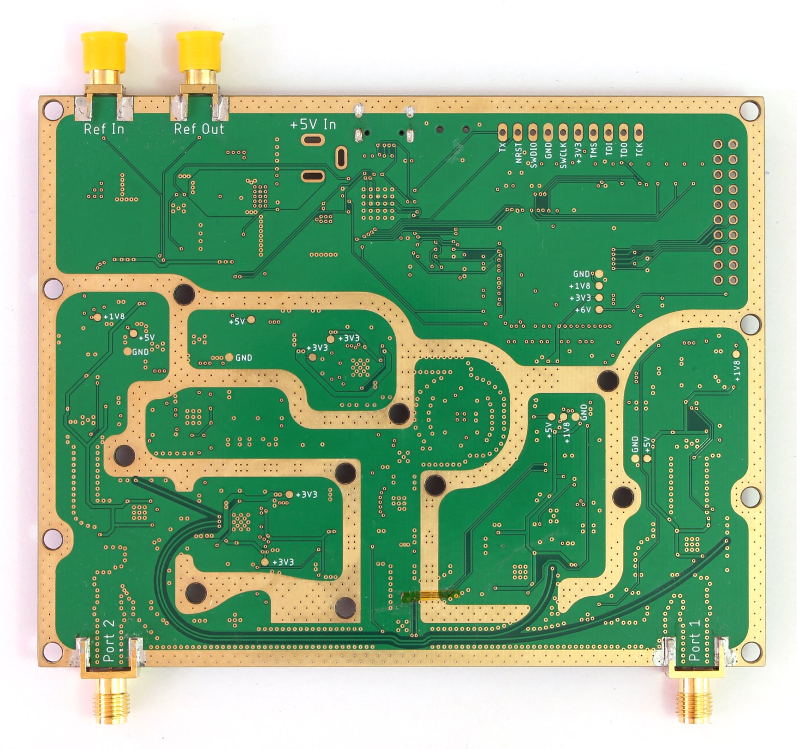
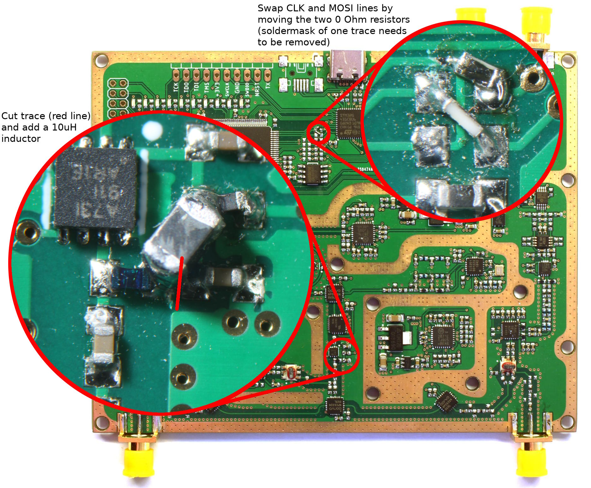
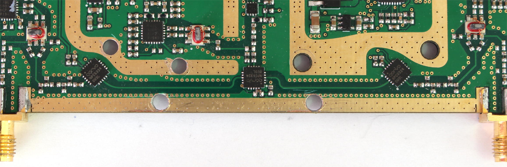
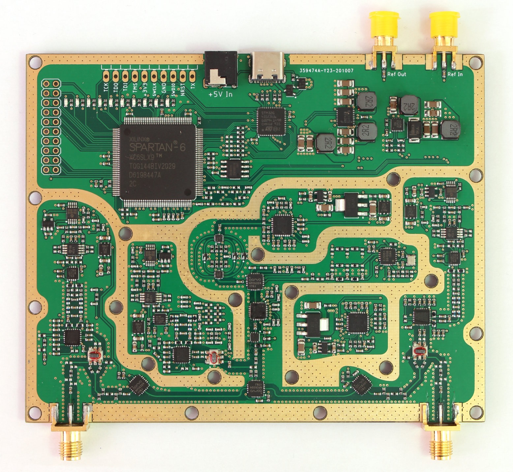
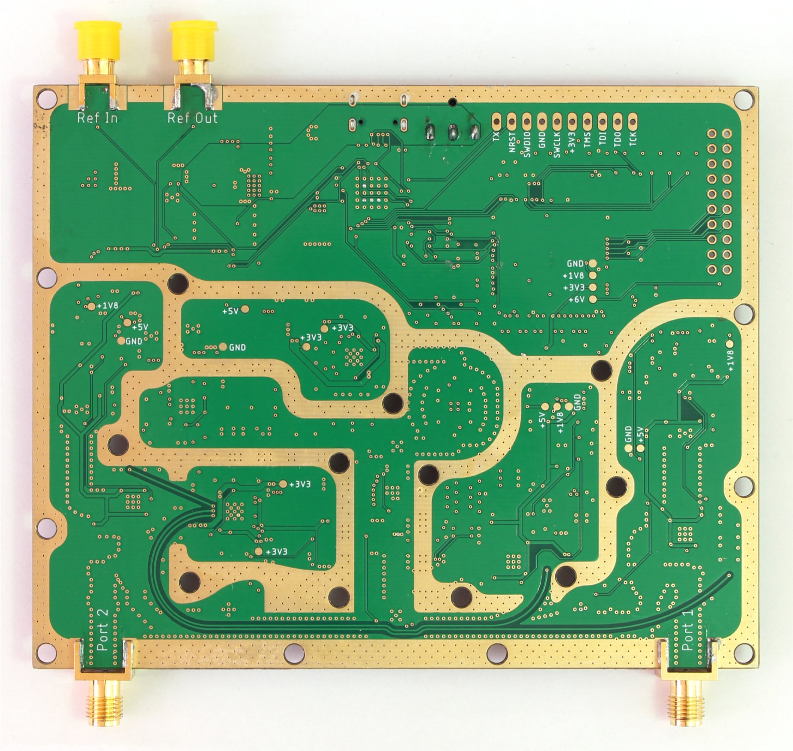

# Versions

So far, two hardware versions of this project exist. There are only small differences between them and the firmware is the same for both versions.

The easiest way to differentiate between them is to check for a DC jack input next to the USB-C connector. The DC jack is only present on the second prototype.
## First Prototype
PCB top                                 |  PCB bottom
:--------------------------------------:|:------------------------------------------:
  |  

The gerber files for this version can be found [here](https://github.com/jankae/VNA2/releases/download/v0.1.0-alpha.1/PCB_Gerber.zip).
### Mistakes and Limitations
* MOSI/CLK for FPGA configuration reversed. This has to be fixed, otherwise the firmware will not start properly.
* Traces on the bottom side routed through aluminium shield. They have to be isolated to prevent shorts.
* The source signal amplifier does not work well at low frequencies
### Modifications
Two modifications are mandatory to get a working device:
* Swap resistors to correct for MOSI/CLK mixup
* Cover exposed tracks on bottom side with kapton tape

MOSI/CLK and amplifier modification     |  Kapton tape for exposed traces
:--------------------------------------:|:------------------------------------------:
 |  

To improve performance, these optional modifications are possible:
* Add an inductor to the signal amplifier. This will increase the output level at low frequencies (<10MHz or so) and improve dynamic range.
* Drill four holes for additional screws. This is a bit risky because the holes have to be drilled at the correct positions (otherwise they might cut internal traces). However, it can improve isolation significantly, leading to approximately the same RF performance as the second prototype.

## Second Prototype
PCB top                                 |  PCB bottom
:--------------------------------------:|:------------------------------------------:
  |  

The gerber files for this version can be found [here](https://github.com/jankae/VNA2/releases/download/v0.1.0-alpha.2/PCB_Gerber.zip).
### Changes from previous version
* Additional DC jack to supply the device if the USB host does not provide enough current
* Additional screws for better isolation
* RC lowpass filters in digital control lines
* Attenuators in the LO feedline to the first stage mixers of port 1 and the reference to decouple them a bit more
* minor footprint and routing adjustments
### Mistakes and Limitations
* Pin mixup on the DC jack. Unfortunately, an easy work-around is not available and the DC jack can not be used at all.
* The source signal amplifier does not work well at low frequencies (same as on first prototype because the problem was discovered too late)
### Modifications
* Same amplifier modification as for the first prototype is possible to improve signal output level at low frequencies
