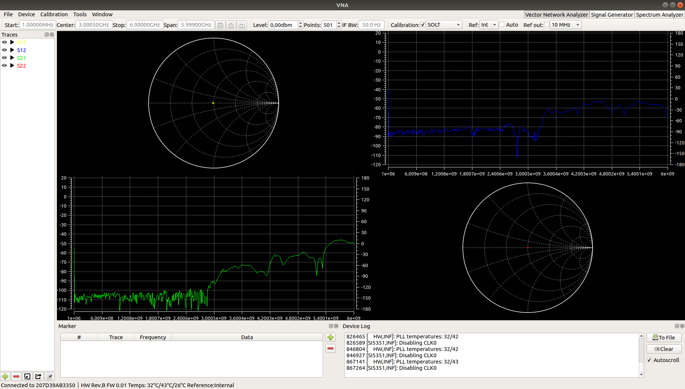
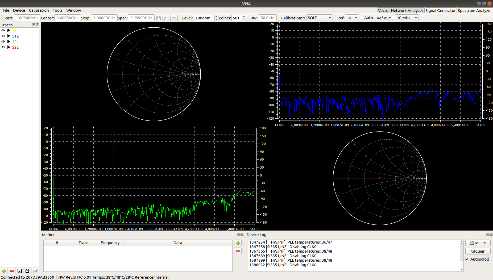
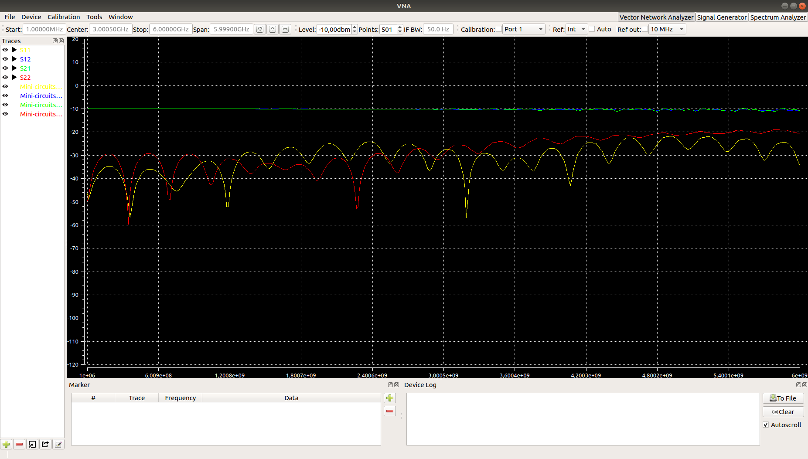
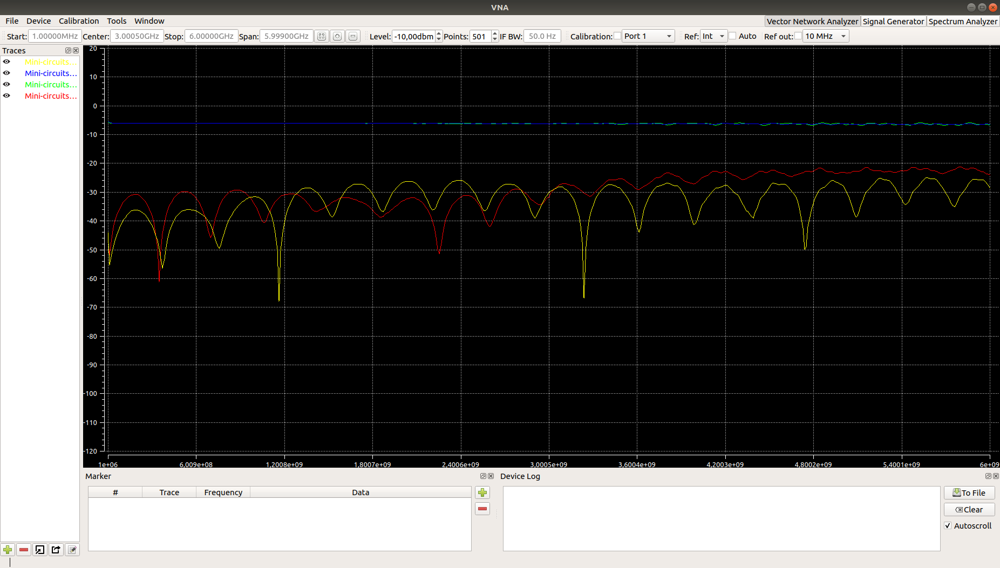
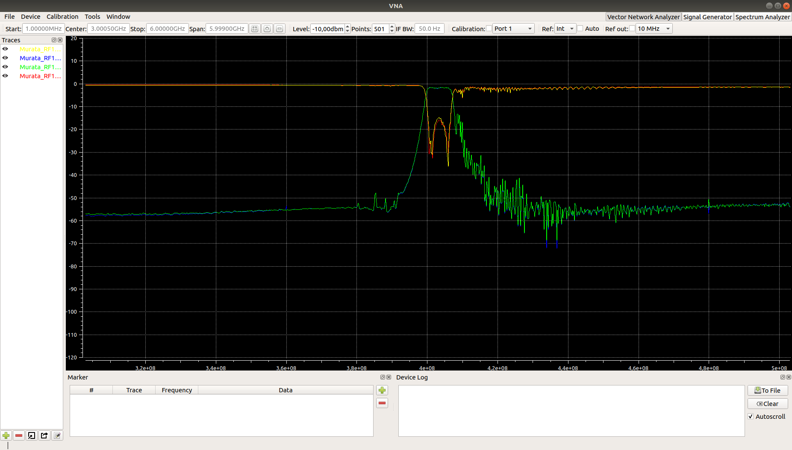
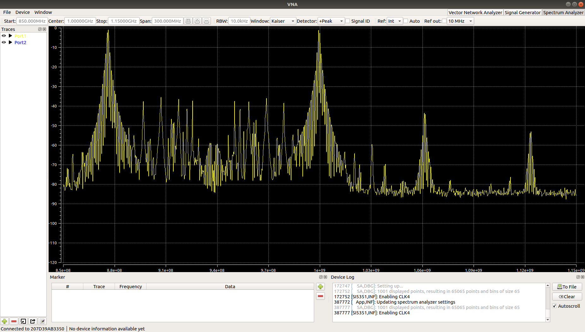
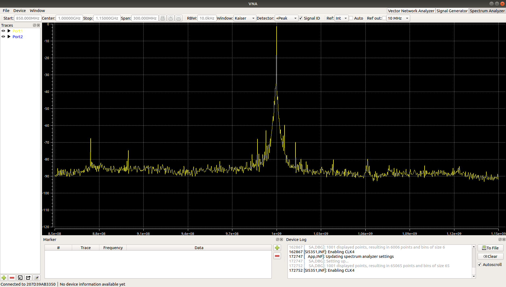

# Example Measurements

The VNA is still in a prototyping stage but some measurements have been done. The performance might still change slightly in future versions.

## VNA Measurements
Unless otherwise noted, all measurements have been taken after a SOLT calibration. The exported touchstone data for all measurements is included in this directory. In the screenshots, the colors of the S-parameters are:
* S11: yellow
* S12: blue
* S21: green
* S22: red

### Prototype_Isolation_SOLT
Both ports terminated into 50Ohm, SOLT calibration without isolation measurement. Up to about 3GHz the isolation is fairly good (with some difference between S12/S21 due to the layout). At frequencies higher than 3GHz it gets quite a bit worse.

### Prototype_Isolation_SOLT+iso
Both ports terminated into 50Ohm, SOLT calibration with optional isolation measurement. This obviously improves isolation, but as soon as the setup is even slightly changed, most of the gained dynamic range is lost again.

### Mini-circuits_VAT-10+
Mini-circuit 10db attenuator connected between the ports.

### Mini-circuits_VAT-6+
Mini-circuit 6db attenuator connected between the ports.

### Murata_RF1419D
403MHz bandpass-filter on small breakout-board connected between the ports.

## Spectrum Analyzer Measurements
**This device is designed as a VNA, not a spectrum analyzer. See user manual for limitations on spectrum analyzer measurements.**

### The effect of signal identification
The setup for the following two measurements is identical, except for the signal ID functionality:
* Center: 1GHz
* Span: 300MHz
* RBW: 10kHz
* Applied signal: Reasonable clean 1GHz CW tone with about 0dbm

With signal ID turned off, the resulting sweep looks pretty bad (only the 1GHz tone is really there, everything else is coming from the device itself, mostly due to aliasing):

When signal ID is enabled, most of the tones disappear. The result is still not perfect, but it should work for quickly checking whether a signal is there and getting a rough idea about its power.

