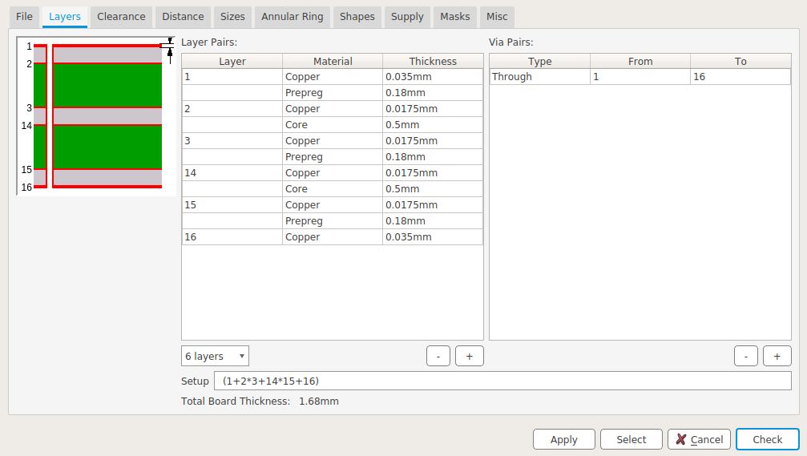

### Stackup

* Exact thickness of the cores is not important, as long as they are significantly thicker than the prepregs
* Recommended Prepreg: 7628
* Example stackup from manufacturer: [JLC06161H-7628 Stackup](https://jlcpcb.com/impedance)

### PCB size

122mm * 98mm
